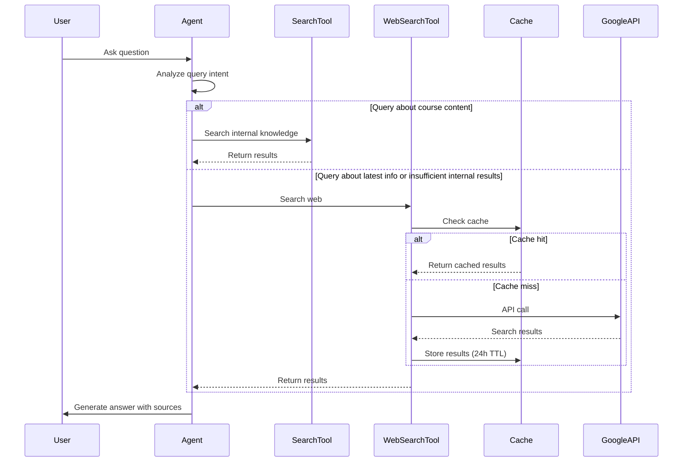

# Design Document - Google Web Search Integration

## Overview

本设计文档描述了如何为 Studify 教育平台的 LangChain Agent 系统集成 Google Custom Search API，使 AI 助手能够在回答问题时获取最新的互联网信息。该功能将与现有的内部搜索工具协同工作，形成混合搜索策略。

## Architecture

### High-Level Architecture

```
┌─────────────────────────────────────────────────────────────┐
│                    Tool Calling Agent                        │
│                 (StudifyToolCallingAgent)                    │
└───────────────────┬─────────────────────────────────────────┘
                    │
        ┌───────────┴───────────┐
        │                       │
        ▼                       ▼
┌───────────────┐      ┌──────────────────┐
│  Search Tool  │      │ Web Search Tool  │
│  (Internal)   │      │   (External)     │
└───────┬───────┘      └────────┬─────────┘
        │                       │
        ▼                       ▼
┌───────────────┐      ┌──────────────────┐
│   Supabase    │      │  Google Custom   │
│   Vector DB   │      │   Search API     │
└───────────────┘      └────────┬─────────┘
                                │
                                ▼
                       ┌──────────────────┐
                       │  Upstash Redis   │
                       │     (Cache)      │
                       └──────────────────┘
```

### Component Interaction Flow



## Components and Interfaces

### 1. Web Search Tool (`web-search-tool.ts`)

核心组件，实现 Google Custom Search API 集成。

#### Interface

```typescript
interface WebSearchInput {
  query: string;
  maxResults?: number;
  safeSearch?: boolean;
}

interface WebSearchResult {
  title: string;
  snippet: string;
  link: string;
  displayLink: string;
}

interface WebSearchResponse {
  results: WebSearchResult[];
  searchTime: number;
  totalResults: number;
  cached: boolean;
}
```

#### Key Methods

```typescript
class WebSearchTool {
  // 执行网络搜索（带缓存）
  async search(query: string, options?: WebSearchOptions): Promise<WebSearchResponse>
  
  // 验证 API 配置
  static validateConfig(): boolean
  
  // 生成缓存键
  private getCacheKey(query: string): string
  
  // 调用 Google API
  private callGoogleAPI(query: string, options: WebSearchOptions): Promise<any>
  
  // 过滤和排序结果
  private filterResults(results: any[]): WebSearchResult[]
}
```

### 2. Search Statistics Tracker (`web-search-stats.ts`)

监控和统计 Web Search Tool 的使用情况。

#### Interface

```typescript
interface SearchStats {
  totalCalls: number;
  successfulCalls: number;
  failedCalls: number;
  cacheHits: number;
  cacheMisses: number;
  averageResponseTime: number;
  dailyQuota: number;
  quotaUsed: number;
  consecutiveFailures: number;
  lastFailureTime: number | null;
  isDisabled: boolean;
}

interface SearchLogEntry {
  timestamp: number;
  query: string;
  resultCount: number;
  responseTime: number;
  cached: boolean;
  success: boolean;
  error?: string;
}
```

#### Key Methods

```typescript
class WebSearchStatsTracker {
  // 记录搜索请求
  logSearch(entry: SearchLogEntry): void
  
  // 获取统计信息
  getStats(): SearchStats
  
  // 检查是否应该禁用工具
  shouldDisable(): boolean
  
  // 重置统计（每日）
  resetDailyStats(): void
  
  // 检查配额警告
  checkQuotaWarning(): void
}
```

### 3. Enhanced Search Tool

更新现有的 `search-tool.ts`，添加结果质量指标。

#### Updates

```typescript
interface EnhancedSearchResponse {
  message: string;
  results: any[];
  count: number;
  confidence: number;  // NEW: 0-1 置信度分数
  hasVideoSegments: boolean;
}
```

### 4. Updated Tool Calling Agent

更新 `tool-calling-integration.ts` 的系统提示，指导 Agent 正确使用两个搜索工具。

#### System Prompt Enhancement

```typescript
const ENHANCED_SYSTEM_PROMPT = `You are an AI assistant for Studify...

Search Strategy:
1. ALWAYS prioritize the 'search' tool for course content, lessons, and video segments
2. Use 'web_search' tool ONLY when:
   - User asks about latest news, trends, or current events (2024+)
   - User explicitly requests web search
   - Internal search returns low confidence results (< 0.6) or few results (< 2)
3. NEVER use 'web_search' for course-specific content
4. Limit 'web_search' to ONE call per query
5. Clearly distinguish between internal knowledge and web sources in your answer

...`;
```

## Data Models

### Cache Data Model

```typescript
// Redis Key: "web_search:{query_hash}"
interface CachedSearchData {
  query: string;
  results: WebSearchResult[];
  timestamp: number;
  expiresAt: number;
  searchTime: number;
}
```

### Statistics Data Model

```typescript
// Redis Key: "web_search_stats:daily:{date}"
interface DailyStats {
  date: string;
  calls: number;
  successes: number;
  failures: number;
  cacheHits: number;
  totalResponseTime: number;
}

// Redis Key: "web_search_stats:global"
interface GlobalStats {
  consecutiveFailures: number;
  lastFailureTime: number | null;
  disabledUntil: number | null;
}
```

## Error Handling

### Error Types

```typescript
enum WebSearchErrorType {
  API_KEY_MISSING = 'API_KEY_MISSING',
  API_KEY_INVALID = 'API_KEY_INVALID',
  QUOTA_EXCEEDED = 'QUOTA_EXCEEDED',
  NETWORK_ERROR = 'NETWORK_ERROR',
  TIMEOUT = 'TIMEOUT',
  INVALID_RESPONSE = 'INVALID_RESPONSE',
  TOOL_DISABLED = 'TOOL_DISABLED'
}

class WebSearchError extends Error {
  constructor(
    public type: WebSearchErrorType,
    message: string,
    public recoverable: boolean = true
  ) {
    super(message);
  }
}
```

### Error Handling Strategy

1. **API 配置错误**: 禁用工具，记录警告，不中断服务
2. **网络错误**: 重试 1 次，失败后返回友好消息
3. **超时错误**: 5 秒超时，返回缓存结果或友好消息
4. **配额超限**: 禁用工具直到次日，记录警告
5. **连续失败**: 3 次连续失败后自动禁用 10 分钟

### Graceful Degradation

```typescript
async function executeSearchWithFallback(query: string): Promise<string> {
  try {
    // Try web search
    const results = await webSearchTool.search(query);
    return formatResults(results);
  } catch (error) {
    if (error instanceof WebSearchError) {
      if (error.type === WebSearchErrorType.TOOL_DISABLED) {
        return "Web search is temporarily unavailable. Using general knowledge instead.";
      }
      if (error.type === WebSearchErrorType.TIMEOUT) {
        return "Search is taking longer than expected. Please try again.";
      }
    }
    // Fallback to general knowledge
    return "I'll answer based on my general knowledge.";
  }
}
```

## Testing Strategy

### Unit Tests

```typescript
describe('WebSearchTool', () => {
  describe('Configuration', () => {
    it('should validate API key presence')
    it('should validate API key format')
    it('should disable tool when config invalid')
  })
  
  describe('Search Functionality', () => {
    it('should return formatted results')
    it('should limit results to maxResults')
    it('should filter inappropriate content')
    it('should prioritize .edu domains')
    it('should handle empty results gracefully')
  })
  
  describe('Caching', () => {
    it('should cache search results')
    it('should return cached results within TTL')
    it('should expire cache after 24 hours')
    it('should generate consistent cache keys')
  })
  
  describe('Error Handling', () => {
    it('should handle API errors gracefully')
    it('should timeout after 5 seconds')
    it('should disable after 3 consecutive failures')
    it('should re-enable after 10 minutes')
  })
})

describe('WebSearchStatsTracker', () => {
  it('should track successful searches')
  it('should track failed searches')
  it('should calculate cache hit rate')
  it('should warn at 90% quota')
  it('should reset daily stats')
})
```

### Integration Tests

```typescript
describe('Web Search Integration', () => {
  it('should integrate with Tool Calling Agent')
  it('should prioritize internal search over web search')
  it('should use web search for latest info queries')
  it('should limit web search to 1 call per query')
  it('should distinguish sources in response')
})
```

### Manual Testing Scenarios

1. **基本搜索**: "What are the latest AI trends in 2026?"
2. **课程内容优先**: "Explain React hooks" (应使用内部搜索)
3. **混合搜索**: "What's new in React 19?" (可能触发 web search)
4. **缓存测试**: 重复相同查询，验证缓存命中
5. **错误处理**: 使用无效 API key，验证优雅降级
6. **配额限制**: 模拟配额超限，验证工具禁用

## Configuration

### Environment Variables

```bash
# Required
GOOGLE_API_KEY=your_google_api_key_here
GOOGLE_CX=your_custom_search_engine_id_here

# Optional (with defaults)
WEB_SEARCH_MAX_RESULTS=5
WEB_SEARCH_TIMEOUT=5000
WEB_SEARCH_CACHE_TTL=86400
WEB_SEARCH_DAILY_QUOTA=100
WEB_SEARCH_SAFE_SEARCH=true
```

### Google Custom Search Engine Setup

1. 访问 [Google Custom Search](https://programmablesearchengine.google.com/)
2. 创建新的搜索引擎
3. 配置搜索整个互联网（不限制特定网站）
4. 启用 SafeSearch
5. 获取 Search Engine ID (CX)
6. 在 [Google Cloud Console](https://console.cloud.google.com/) 启用 Custom Search API
7. 创建 API Key

## Performance Considerations

### Optimization Strategies

1. **缓存优先**: 24 小时 TTL，减少 API 调用
2. **结果限制**: 最多返回 5 条结果，避免信息过载
3. **超时控制**: 5 秒超时，保证响应速度
4. **并行处理**: 内部搜索和 web 搜索可并行执行（如果需要）
5. **配额管理**: 每日限制 100 次调用，接近限制时警告

### Expected Performance

- **缓存命中**: < 50ms
- **API 调用**: 500-2000ms
- **总响应时间**: < 5000ms (含超时)
- **缓存命中率目标**: > 30%

## Security Considerations

1. **API Key 保护**: 
   - 仅在服务器端使用
   - 通过环境变量配置
   - 不在日志中暴露

2. **内容过滤**:
   - 启用 SafeSearch
   - 过滤不适当内容
   - 优先教育网站

3. **速率限制**:
   - 每日配额限制
   - 防止滥用
   - 自动禁用机制

4. **输入验证**:
   - 清理搜索查询
   - 防止注入攻击
   - 限制查询长度

## Monitoring and Logging

### Metrics to Track

```typescript
interface WebSearchMetrics {
  // Performance
  averageResponseTime: number;
  p95ResponseTime: number;
  p99ResponseTime: number;
  
  // Usage
  totalSearches: number;
  dailySearches: number;
  cacheHitRate: number;
  
  // Reliability
  successRate: number;
  errorRate: number;
  timeoutRate: number;
  
  // Quota
  quotaUsage: number;
  quotaRemaining: number;
}
```

### Log Levels

```typescript
// INFO: Normal operations
console.log('🔍 Web search: query="latest AI trends", results=5, time=1234ms, cached=false');

// WARN: Approaching limits
console.warn('⚠️ Web search quota at 90%: 90/100 calls used today');

// ERROR: Failures
console.error('❌ Web search failed: API_KEY_INVALID');

// DEBUG: Detailed info
console.debug('🔧 Web search cache: key=abc123, hit=true, ttl=82800s');
```

## Deployment Considerations

### Rollout Strategy

1. **Phase 1**: 部署 Web Search Tool（禁用状态）
2. **Phase 2**: 配置 API credentials，启用工具
3. **Phase 3**: 更新 Agent 系统提示
4. **Phase 4**: 监控使用情况和性能
5. **Phase 5**: 根据反馈调整参数

### Rollback Plan

如果出现问题：
1. 通过环境变量禁用 Web Search Tool
2. Agent 自动回退到仅使用内部搜索
3. 不影响现有功能

### Monitoring Checklist

- [ ] API 调用成功率 > 95%
- [ ] 平均响应时间 < 2s
- [ ] 缓存命中率 > 30%
- [ ] 每日配额使用 < 90%
- [ ] 无连续失败 > 3 次
- [ ] 错误日志无异常模式

## Future Enhancements

1. **多搜索引擎支持**: 添加 Bing、DuckDuckGo 作为备选
2. **智能缓存**: 基于查询相似度的缓存匹配
3. **结果排序优化**: 基于教育相关性的自定义排序
4. **搜索历史分析**: 分析常见查询，预缓存结果
5. **A/B 测试**: 测试不同搜索策略的效果
