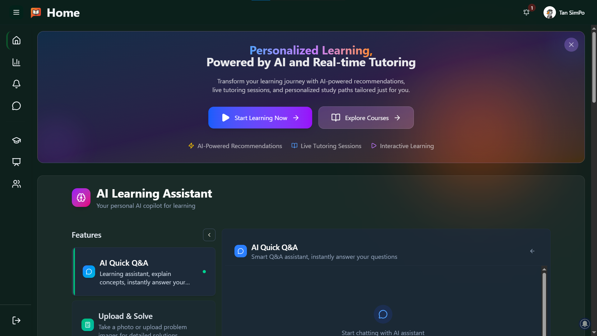

<!-- 语言切换 | Language Switcher -->
<p align="right">
  <a href="./README.md">English</a> · <b>简体中文</b>
</p>

<!-- Banner -->
<p align="center">
  
</p>

<!-- Typing SVG -->
<p align="center">
  <a href="https://git.io/typing-svg">
    
  </a>
</p>

<!-- Badges -->
<p align="center">
  
  
  
  
  
  
  
</p>

<p align="center">
  
</p>

# Studify 🎓 AI 学习平台

Studify 是一个面向学生与导师的 AI 学习平台，集成了课程系统、教室系统、社区系统与 AI 能力（RAG 搜索、语义检索、学习路径、视频转写与问答、个性化推荐等），提供从学习到创作、从互动到支付的完整闭环体验。

## **1. Track & Problem Statement**

### Competition:
**Codenection 2025 Hackathon**

### Track:
**Student Lifestyle** → *Tutoring for Students*

### Problem Statement:
Many students struggle with academic challenges, including difficulty understanding course material, limited access to personalized help, and inefficient study habits. Traditional tutoring services are often expensive, inconvenient, or unavailable outside fixed hours, leaving students without adequate support when they need it most.

### Goal:
Develop a **tutoring platform** that provides **on-demand, affordable, and personalized academic assistance**. The platform connects students with tutors, offers interactive learning tools, and provides curated study resources to improve academic outcomes and boost student confidence.

## 技术栈

<p>
  
</p>

- **前端**：Next.js 15、React 19、TypeScript、TailwindCSS、shadcn/ui、Framer Motion
- **后端**：Supabase（Auth/DB/Storage）、Upstash Redis、QStash 队列
- **AI**：LangChain、OpenRouter、HuggingFace Whisper、Mermaid 可视化
- **支付**：Stripe（Checkout、Connect、Webhook）
- **通知**：OneSignal Web Push
- **i18n**：next-intl

## 截图/演示

<p>
  
</p>

## 功能总览

- **课程系统**：课程/模块/课时、学习进度、测验、笔记、购买与支付
- **教室系统**：班级/成员、作业、直播、出勤、白板协作
- **社区系统**：群组、帖子、评论、反应、成就与签到
- **AI 能力**：双模型嵌入（E5-Small + BGE-M3）、语义搜索、AI 学习教练、视频转写、RAG QA
- **通知与增长**：OneSignal 推送、成就/积分、学习统计

> 接口访问控制：后端 API 通过 `utils/auth/server-guard.ts` 的 `authorize('student'|'tutor'|'admin')` 进行鉴权，并在数据库层做所有权校验（RLS）。

## 功能亮点

- **AI 随看随问 + 术语卡片**
  - 播放器时间感知问答（±30 秒窗口）、智能术语识别与跳转
  - 接口与组件：`app/api/video/qa`、`components/ai-coach/*`、`components/ai/*`
- **丰富的视频互动**
  - 观看计数、点赞/取消赞、弹幕（限流/审核）、线程化评论与评论点赞
  - 接口：`/api/video/views`、`/api/video/likes`、`/api/video/danmaku`、`/api/video/comments`、`/api/video/comments/[id]/likes`
  - 播放器：`components/video/bilibili-video-player.tsx`
- **语义搜索与嵌入系统**
  - 双模型（E5-Small 384维 + BGE-M3 1024维）混合检索、后台队列、批处理与重试
  - 关键文件：`db/migrations/20250905_embedding_system.sql`、`lib/langChain/embedding.ts`、`lib/langChain/vectorstore.ts`、`app/api/embeddings/*`
- **可靠的后台处理**
  - 基于 QStash 的 Whisper 转写流水线，自动预热与指数回退重试
  - 转写步骤：`app/api/video-processing/steps/transcribe/route.ts`
- **真实结算的支付体系**
  - Stripe Checkout + Connect，90/10 分成，支持定时释放与失败重试
  - 接口：`/api/course/webhook`、`/api/tutor/stripe-connect`、`/api/tutor/earnings`、`/api/tutor/earnings/release`
- **通知与增长**
  - OneSignal Web Push + 数据库存储、未读计数、用户偏好设置
  - Worker：`public/OneSignalSDKWorker.js`；前端在 `components/`、`hooks/` 下集成
- **国际化与体验**
  - `next-intl` 多语言、玻璃拟态 UI、深浅色模式、可访问性
- **Admin 与权限**
  - 管理后台与统计：`app/api/admin/*`、`components/admin/*`、`hooks/admin/*`

## 性能与安全

- **安全**：关键表启用 RLS，API 层 `authorize(...)`，所有权校验与审计日志
- **可靠**：React Query 缓存、Redis 缓存、预热 + 重试、弹幕限流、数据库索引与触发器
- **可扩展**：嵌入与转写后台处理、分页 API、混合向量搜索

## PWA 与 Capacitor

- **PWA 层（Serwist + Manifest）**
  - Service Worker：在 `app/sw.ts` 定义，通过 `@serwist/next`（见 `next.config.ts`）打包到 `public/sw.js`。开发环境默认禁用，生产环境启用。
  - Manifest：`public/manifest.json` 定义名称、图标、`start_url`、`display: 'standalone'` 等。可按需替换图标尺寸与品牌色。
  - OneSignal Worker：`public/OneSignalSDKWorker.js` 已在 `next.config.ts` 中通过 `exclude` 排除，不被 Serwist 接管，并设置了正确的 Header 以保证注册成功。
  - 验证：本地打包后在 Chrome DevTools → Application → Service Workers 查看是否注册成功。
    ```bash
    npm run build && npm start
    ```

- **Capacitor 移动外壳**
  - 配置：`capacitor.config.ts`
    ```ts
    const config: CapacitorConfig = {
      appId: "com.studify.platform.vercel.app",
      appName: "Studify",
      webDir: "empty", // 使用远程服务器
      server: { url: "https://studify-platform.vercel.app", cleartext: true },
    };
    ```
  - 开发（Android/iOS）：将 `server.url` 指向你的本地开发服务
    - Android 模拟器：`http://10.0.2.2:3000`
    - 真机（同局域网）：`http://<LAN-IP>:3000`
    - 步骤：
      ```bash
      # 1) 启动 Next.js
      npm run dev

      # 2) 同步原生项目
      npx cap sync android   # 或: npx cap sync ios

      # 3) 运行应用
      npx cap run android    # 或使用 Android Studio: npx cap open android
      ```
    - 注意：`cleartext: true` 便于本地使用 http 调试；生产请使用 https。
  - 生产发布：
    - 先部署 Web（例如 Vercel），将 `server.url` 指向正式 https 域名（仓库已示例设置）。
    - 然后打包：
      ```bash
      npx cap sync android && npx cap open android   # 在 Android Studio 构建/签名
      npx cap sync ios && npx cap open ios           # 在 Xcode 归档/签名
      ```
    - 可选（高级）：若应用完全静态，可将 `webDir` 指向静态导出目录（如 `out`）。但 SSR/App Router 场景建议保留 `server.url` 远程加载模式。
  - 推送通知（移动端）：
    - Web Push 仍使用 `public/OneSignalSDKWorker.js`。
    - 若切换到原生推送，可集成相应 Capacitor 插件并完成平台配置；当前仓库以 Web Push（OneSignal）为主，且 `next.config.ts` 已为其设置了 SW Headers。


