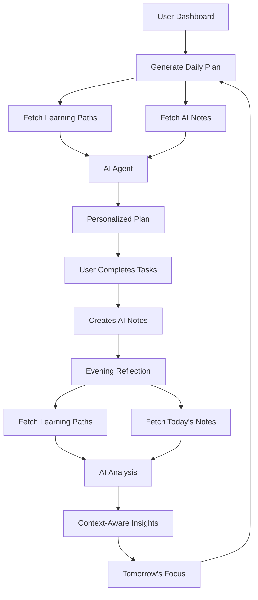

# AI Learning Coach - Context Integration Enhancement

## 🎯 Overview

The AI Learning Coach system has been enhanced to use **Learning Paths** and **AI Notes** as context for generating personalized daily plans and retrospective analyses. This creates a more coherent, goal-oriented learning experience that builds upon the user's own insights and long-term objectives.

## 🔄 What Changed

### 1. Daily Plan Generation (`/api/ai/coach/daily-plan`)

**Added Context:**
- ✅ Active Learning Paths (up to 3 most recent)
- ✅ Recent AI Notes (last 10 notes)

**How It's Used:**
```typescript
// The AI now receives this additional context:
context.activeLearningPaths = learningPaths || [];
context.recentAINotes = aiNotes || [];
```

**Benefits:**
- **Goal Alignment**: Daily tasks are aligned with learning path milestones
- **Continuity**: Tasks build upon concepts from recent AI notes
- **Specificity**: AI references actual learning paths in task descriptions
- **Motivation**: Messages incorporate progress toward learning path goals

**Example Output:**
```json
{
  "insights": "Based on your JavaScript learning path, you're 60% through the fundamentals. Your recent notes on async/await show strong understanding - let's practice this today!",
  "motivationMessage": "You're making great progress on your Full-Stack Developer path! Today's tasks will move you closer to the React milestone. 🚀",
  "tasks": [
    {
      "title": "Practice async/await from your notes",
      "description": "Review your AI note from 2 days ago and build upon those concepts with hands-on practice"
    }
  ]
}
```

### 2. Retrospective Analysis (`/api/ai/coach/retro`)

**Added Context:**
- ✅ Active Learning Paths (up to 3 most recent)
- ✅ Today's AI Notes (created during the day)
- ✅ Recent AI Notes (last 5 for pattern analysis)

**How It's Used:**
```typescript
// The AI now receives:
data.activeLearningPaths = learningPaths || [];
data.todayAINotes = aiNotes || [];  // Notes created today
data.recentAINotes = recentAINotes || [];  // Recent notes for context
```

**Benefits:**
- **Path Progress Tracking**: Analysis shows how today's learning moved you along your learning path
- **Note-Taking Recognition**: Acknowledges AI notes as evidence of deep learning
- **Pattern Detection**: Identifies learning patterns from note-taking frequency
- **Goal Orientation**: Tomorrow's focus aligns with learning path next steps

**Example Output:**
```json
{
  "analysis": "You completed 4/6 tasks and created 2 AI notes today, showing strong engagement. Your notes on Redux align perfectly with your Full-Stack path's state management milestone.",
  "suggestions": "Your learning path shows 'Authentication' as the next milestone. Tomorrow, focus on JWT concepts building on your strong async foundation.",
  "patterns": "You tend to take more notes when learning new concepts (5 notes this week on async patterns). This is excellent for retention!",
  "nextFocus": "Move to the Authentication module in your Full-Stack path. Your solid async understanding will help with token handling."
}
```

## 📊 Data Flow Diagram



## 🔧 Technical Implementation

### API Endpoints Modified

1. **`POST /api/ai/coach/daily-plan`**
   - Added learning paths query
   - Added AI notes query
   - Enhanced AI prompt with context instructions

2. **`POST /api/ai/coach/retro`**
   - Added learning paths query
   - Added today's AI notes query
   - Added recent AI notes query for patterns
   - Enhanced AI prompt with context instructions

### Database Queries Added

```sql
-- Learning Paths (used in both endpoints)
SELECT * FROM learning_paths
WHERE user_id = ? 
  AND is_active = true
ORDER BY created_at DESC
LIMIT 3;

-- AI Notes for Daily Plan
SELECT * FROM course_notes
WHERE user_id = ?
  AND note_type = 'ai_generated'
ORDER BY created_at DESC
LIMIT 10;

-- AI Notes for Retrospective (today's notes)
SELECT * FROM course_notes
WHERE user_id = ?
  AND note_type = 'ai_generated'
  AND created_at >= ?
  AND created_at <= ?;

-- AI Notes for Retrospective (recent notes)
SELECT * FROM course_notes
WHERE user_id = ?
  AND note_type = 'ai_generated'
ORDER BY created_at DESC
LIMIT 5;
```

## 🎨 UI Enhancements

### Daily Coach Card
```typescript
// Added informative comment explaining context usage
const handleGeneratePlan = () => {
  // AI Coach generates personalized plan using:
  // - User's learning paths (long-term goals and roadmaps)
  // - Recent AI notes (insights and key learnings)
  // - Active courses and progress
  // - Learning statistics and patterns
  generatePlan.mutate();
};
```

### Evening Reflection Modal
```typescript
// Added comment explaining comprehensive analysis
const handleSubmit = async () => {
  // AI Coach analyzes reflection using:
  // - User's learning paths (to show progress toward goals)
  // - Today's AI notes (evidence of deep learning)
  // - Recent AI notes (for pattern analysis)
  // - Actual performance data vs self-assessment
  await createRetro.mutateAsync(formData);
};
```

## 📈 Benefits for Users

### 1. **Coherent Learning Journey**
- Daily tasks align with long-term learning path goals
- No random task assignments - everything has purpose
- Clear progression toward milestones

### 2. **Building on Insights**
- AI references concepts from user's own notes
- Tasks build upon previously saved insights
- Encourages continuous learning and reflection

### 3. **Personalized Motivation**
- Messages reference specific learning path progress
- Acknowledgment of note-taking efforts
- Goal-oriented encouragement

### 4. **Intelligent Reflection**
- Analysis shows how daily work advances learning paths
- Recognition of deep learning through note-taking
- Tomorrow's focus logically follows path progression

## 🚀 Future Enhancements

### Potential Additions:
1. **Learning Path Milestones in Tasks**: Explicitly tag tasks with learning path milestones
2. **Note-Based Quizzing**: Generate quiz questions from user's AI notes
3. **Path Progress Visualization**: Show visual progress along learning paths in coach card
4. **Smart Note Recommendations**: Suggest creating notes at optimal learning moments
5. **Cross-Path Synthesis**: Identify connections between multiple learning paths

### Advanced Features:
- **Adaptive Difficulty**: Adjust task difficulty based on note quality and frequency
- **Spaced Repetition**: Use AI notes to generate spaced repetition reviews
- **Learning Style Detection**: Analyze notes to understand learning preferences
- **Concept Mapping**: Build concept maps from learning paths and notes

## 📝 Code Files Modified

1. `app/api/ai/coach/daily-plan/route.ts`
   - Added AI notes context fetching
   - Enhanced AI prompt with learning path and notes instructions

2. `app/api/ai/coach/retro/route.ts`
   - Added learning paths context fetching
   - Added today's and recent AI notes fetching
   - Enhanced AI prompt with comprehensive context instructions

3. `hooks/ai-coach/use-ai-coach.ts`
   - Added comments documenting context enhancements

4. `components/ai-coach/daily-coach-card.tsx`
   - Added informative comments about context usage

5. `components/ai-coach/evening-reflection-modal.tsx`
   - Added informative comments about analysis context

6. `documentation/ai/AI_LEARNING_COACH_SYSTEM.md`
   - Updated with context integration details

## ✅ Testing Checklist

- [ ] Generate daily plan with active learning paths → Tasks should reference paths
- [ ] Generate daily plan with recent AI notes → Tasks should build on note concepts
- [ ] Create evening reflection with learning paths → Analysis should show path progress
- [ ] Create evening reflection after taking notes → Analysis should acknowledge notes
- [ ] Verify AI insights mention specific learning path names
- [ ] Verify motivation messages reference learning path milestones
- [ ] Check retrospective suggestions align with next learning path steps

## 🎯 Success Metrics

**Quantitative:**
- % of daily tasks that reference learning path milestones
- % of retrospective analyses that mention AI notes
- User engagement rate with context-aware suggestions
- Learning path completion rate improvement

**Qualitative:**
- User feedback on task relevance
- Perceived value of personalized insights
- Satisfaction with goal-oriented daily plans

---

**🎉 The AI Learning Coach now provides a truly personalized, context-aware learning experience that respects and builds upon each user's unique learning journey!**
